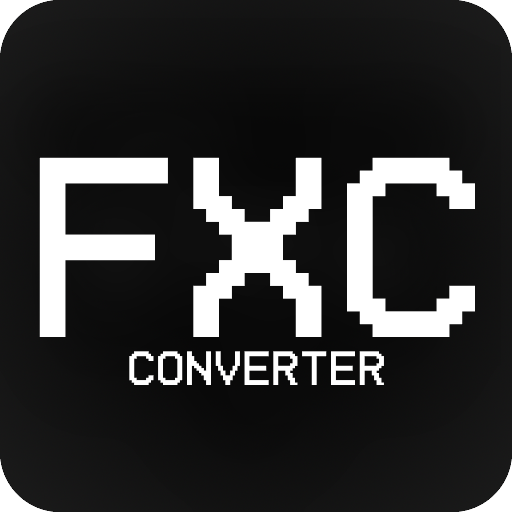

# FXC Converter

<p align="center">
  
</p>


<p align="center">
  <strong>Unpack and repack .fxc shader files for Grand Theft Auto 5 with ease</strong>
</p>

<p align="center">
  <a href="#features">Features</a> •
  <a href="#installation">Installation</a> •
  <a href="#usage">Usage</a> •
  <a href="#screenshots">Screenshots</a> •
  <a href="#example-shaders">Example Shaders</a> •
  <a href="#license">License</a> •
  <a href="#contributing">Contributing</a>
</p>

## Features

🔧 **Unpack `.fxc` Files**: Extract embedded shader files from `.fxc` containers.

📦 **Repack `.fxc` Files**: Repack `.fxc` files with modified shader data, applying custom patches.

🖥️ **User-Friendly GUI**: Simple and intuitive interface using `egui` and `eframe`.

🎮 **GTA 5 Compatible**: Designed specifically for working with Grand Theft Auto 5 shader files.

## Installation

### Pre-built Binaries

Download the latest release from our [GitHub Releases](https://github.com/gtasnail/fxc-converter/releases) page.

### Building from Source

1. Clone the repository:
    ```sh
    git clone https://github.com/gtasnail/fxc-converter.git
    cd fxc-converter
    ```

2. Build the project:
    ```sh
    cargo build --release
    ```

3. Run the application:
    ```sh
    cargo run --release
    ```

## Usage

[Click here to watch the video](https://forum-cfx-re.akamaized.net/original/5X/4/e/d/8/4ed8ec1429f8061d1475b9aa1f79a6bfb85b0054.mp4)


### Unpacking FXC Files

1. Click "📁 Select FXC File" to choose an `.fxc` file.
2. Select an output folder for the unpacked shaders.
3. Click "🚀 Unpack" to start the extraction process.
4. View results and logs in the UI.

> **Tip**: Use [HLSL Decompiler](https://github.com/etnlGD/HLSLDecompiler/releases/tag/0.1) to convert `o#` files to HLSL for rebuilding with [FXC](https://learn.microsoft.com/en-us/windows/win32/direct3dtools/fxc).

### Packing FXC Files

1. Click "📁 Select FXC File" to choose the base `.fxc` file.
2. Click "📁 Select Patch File" to choose a patch file (your compiled `.cso` file).
3. Enter the shader patch offset (e.g., 13025 would be the offset from `directional.o13025` for example).
4. Select an output folder for the new `.fxc` file.
5. Click "📦 Pack" to create the new `.fxc` file.

## Screenshots

### Main UI


### Normal Directional Light Rendering (Example POC)


## Example Shaders

The `/example-shaders/` directory contains example shaders, including a demonstration of normal rendering from the g-buffer in `directional.fxc`. This can serve as a starting point for your own shader modifications.

## License

This project is licensed under the MIT License. See the [LICENSE](LICENSE) file for details.

## Contributing

We welcome contributions, issues, and feature requests! Check out our [issues page](https://github.com/gtasnail/fxc-converter/issues) to get started.

## Acknowledgments

- [egui](https://github.com/emilk/egui) for the graphical user interface.
- [eframe](https://github.com/emilk/egui/tree/master/eframe) for the application framework.
- [Alweul](https://www.gta5-mods.com/tools/gta-5-shader-unpacker) 


